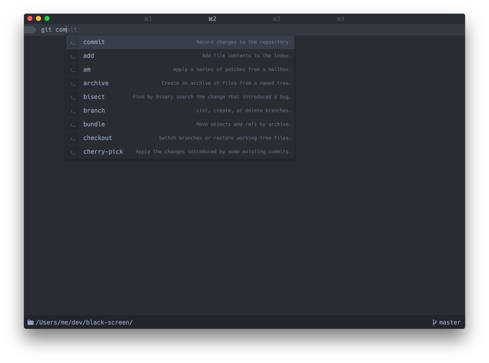
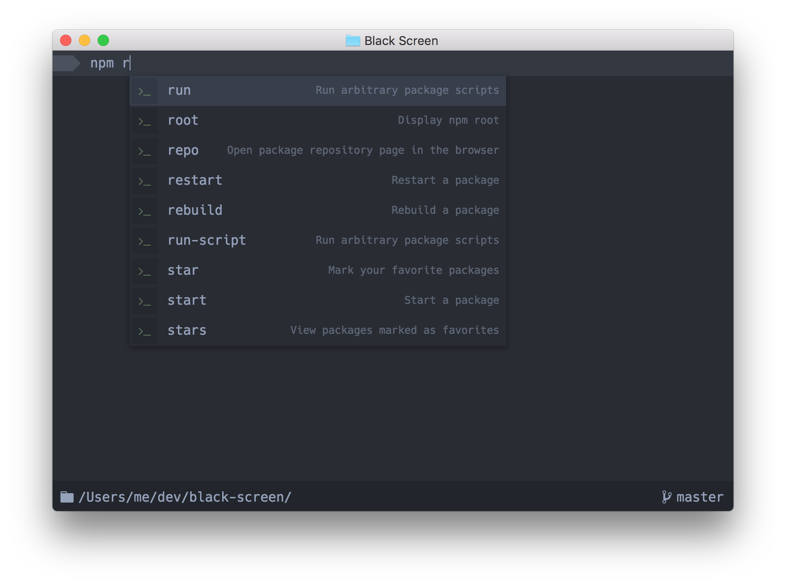
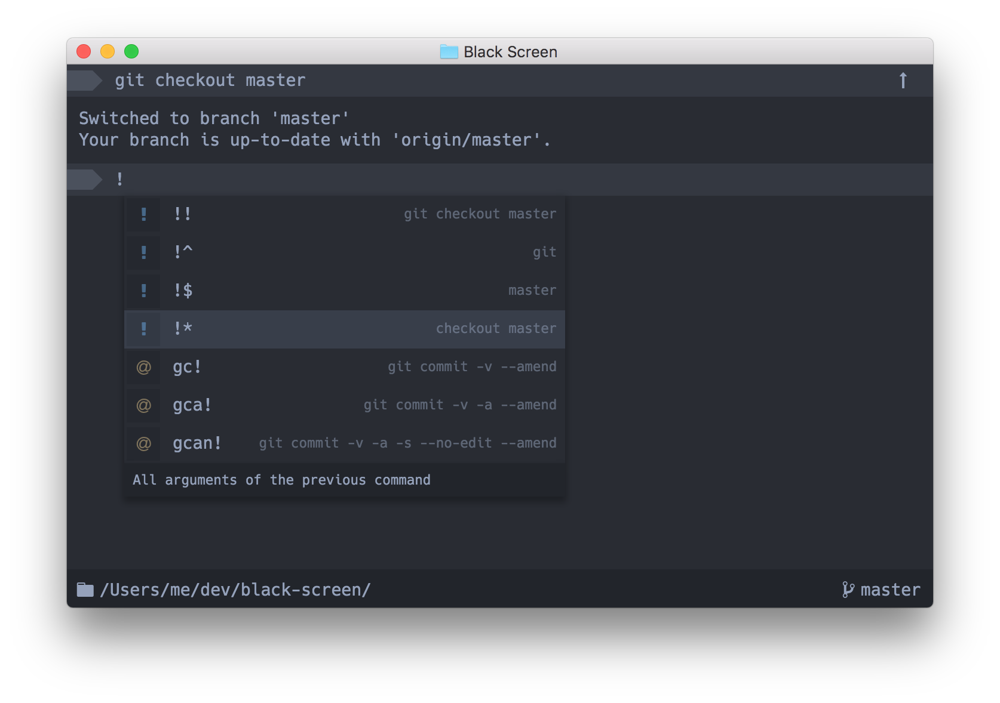
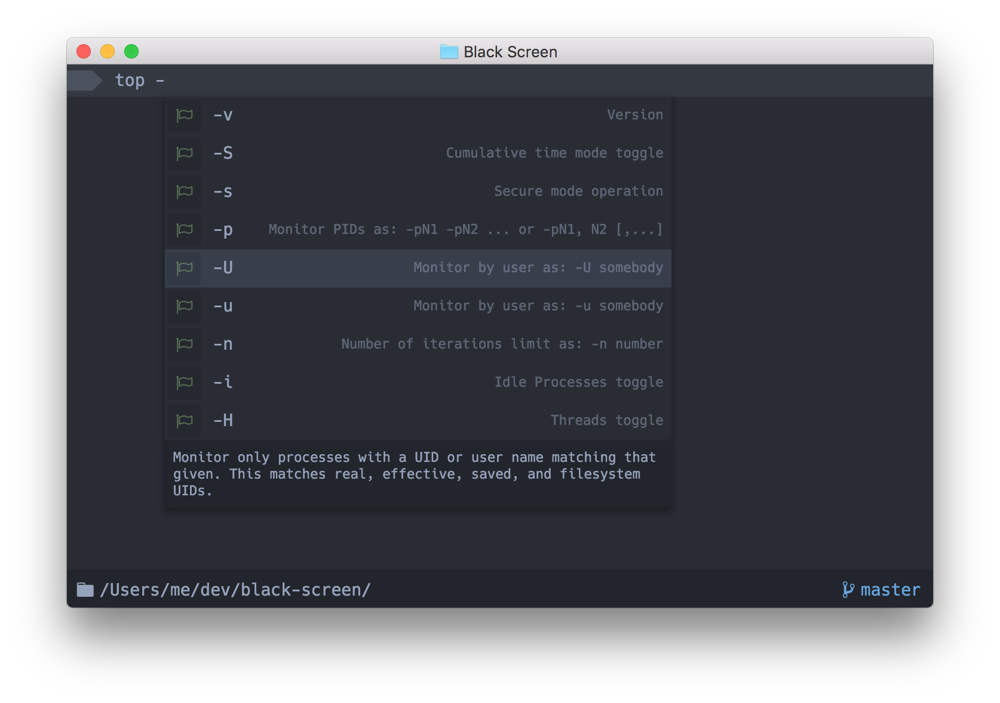
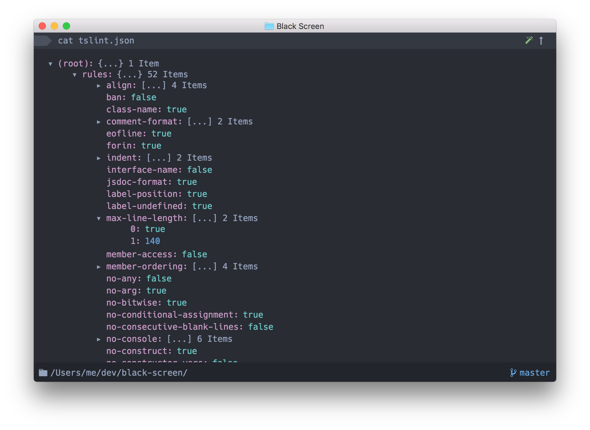
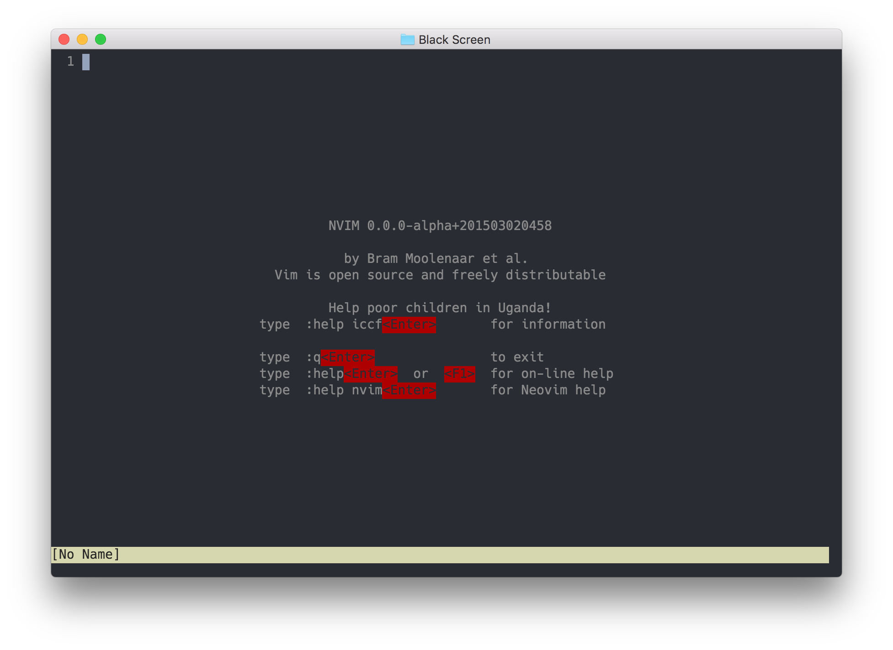
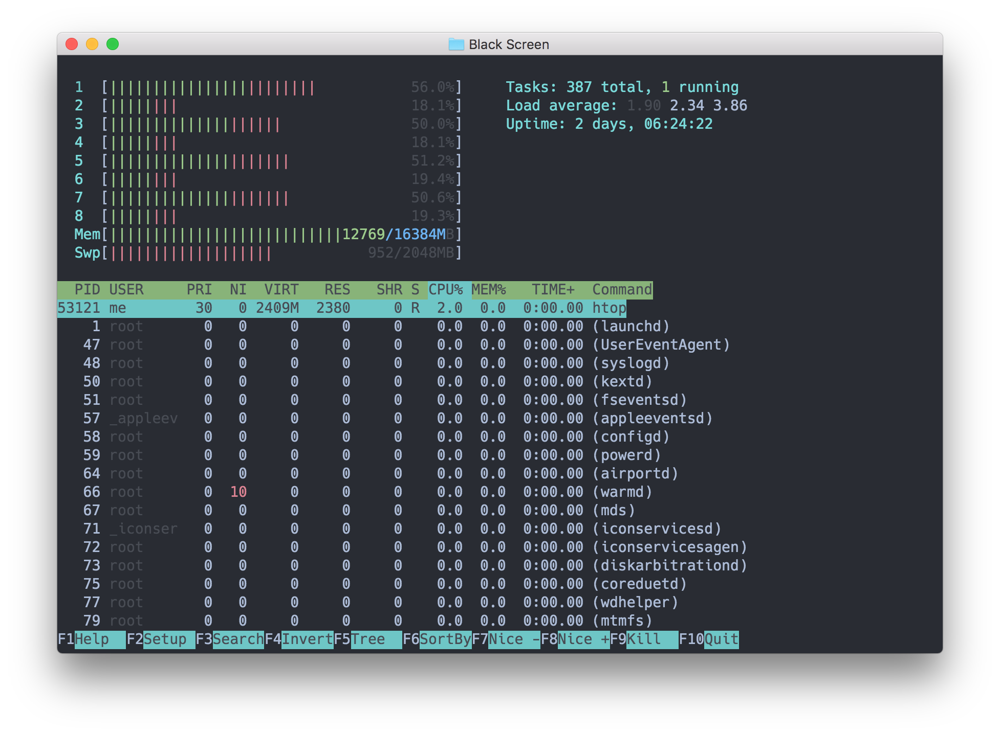
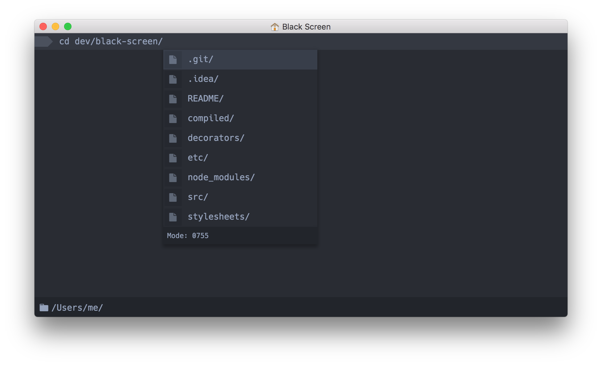

[](https://gitter.im/shockone/black-screen?utm_source=badge&utm_medium=badge&utm_campaign=pr-badge&utm_content=badge)
[](https://travis-ci.org/shockone/black-screen)

What Is It?
-----------

Black Screen is an IDE in the world of terminals. Strictly speaking, it's both a
terminal emulator and an *interactive* shell based on [Electron](http://electron.atom.io/).
Also, unlike most of the emulators you can meet nowadays it uses HTML and CSS for its UI (exactly as Atom does), 
which means we can [stop misusing unicode characters](https://github.com/vim-airline/vim-airline) 
and make a better looking terminal with appropriate tools.



###### Autocompletion

Black Screen shows the autocompletion box as you type and tries to be smart about what to suggest.
Often you can find useful additional information on the right side of the autocompletion, e.g. expanded alias value,
history substitutions for `!!`, command descriptions, value of the previous directory (`cd -`), etc.

###### Compatibility

We aim to be compatible at least with [VT100](https://en.wikipedia.org/wiki/VT100). All the programs (emacs, ssh, vim) should work as expected.

Install
------------

```bash
brew update
brew cask install black-screen
```

Linux and Windows builds will be available after 1.0.0 release. Currently only OS X is supported to speed up the development process.

Technologies
------------

* [Electron](http://electron.atom.io/)
* [TypeScript](http://www.typescriptlang.org/)
* [ReactJS](https://facebook.github.io/react/)


More Screenshots
----------------











Development Setup
------------

```bash
git clone https://github.com/shockone/black-screen.git && cd black-screen
npm start
```

To create a standalone application, execute `npm run pack` in the project directory.

Contributing
------------

See [Contributing Guide](CONTRIBUTING.md).

License
-------

[The MIT License](LICENSE).
