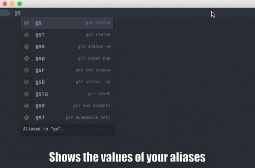

[](https://gitter.im/shockone/black-screen?utm_source=badge&utm_medium=badge&utm_campaign=pr-badge&utm_content=badge)


What Is It?
-----------

Black Screen is an IDE in the world of terminals. Strictly speaking, it's both a
terminal emulator and an *interactive* shell based on [Electron](http://electron.atom.io/).
Also, unlike most of the emulators you can meet nowadays it uses HTML and CSS for its UI (exactly as Atom does), 
which means we can [stop misusing unicode characters](https://github.com/vim-airline/vim-airline) 
and make a better looking terminal with appropriate tools.


###### Autocompletion


Black Screen shows the autocompletion box as you type and tries to be smart about what to suggest.
Often you can find useful additional information to the right of the autocomplete, e.g. expanded alias value, 
history substitutions for `!!` and friends, command descriptions, etc. And you can [write your own autocompletion providers](src/plugins/autocompletion_providers) too!

###### Compatibility

We aim to be compatible at least with [VT100](https://en.wikipedia.org/wiki/VT100), meaning that all your favorite programs (emacs, vim, ssh, htop, etc.) should work as expected.

Installation
------------

```bash
git clone https://github.com/shockone/black-screen.git && cd black-screen
npm i
npm start
```

To create a standalone application, execute `npm run package` in the project directory.

**Note: Only OS X is currently supported, although there are good chances it will work on Linux. We plan to make Black Screen work on all the major platforms in the future.**

Technologies
------------

* [Electron](http://electron.atom.io/)
* [TypeScript](http://www.typescriptlang.org/)
* [ReactJS](https://facebook.github.io/react/)


More Screenshots
----------------


TODO
----

You can find the list of items currently being worked on in this issue: [TODO](https://github.com/shockone/black-screen/issues/58)

Contributing
------------

See [Contributing Guide](CONTRIBUTING.md).

License
-------

[The MIT License](LICENSE).
