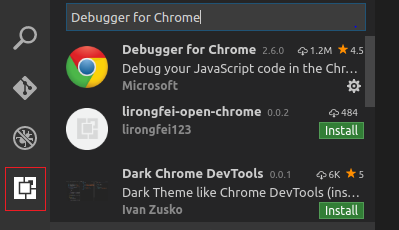
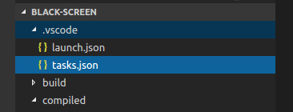
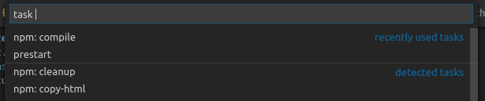
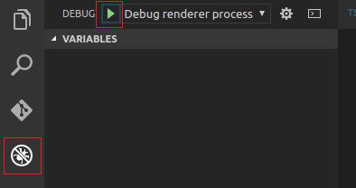

# Debugging black-screen in Visual Studio Code

Microsoft's open source Visual Studio Code (vscode) provides debugging for Typescript based applications.

The recommended steps for debugging black-screen in vscode are described in the steps below.

## Step 1. Install the Debugger for Chrome Extension

To debug Electron based applications the vscode "Debugger for Chrome" extension is required.

To install this extension choose the <b>Extensions</b> icon on the left hand side. Then search for and select the <b>Debugger for Chrome</b>. The extension should take about a minute to install after which you will be prompted to reload vscode.



## Step 2. Setup vscode project build and debug configuration

Under the `.vscode` folder create the `launch.json` and `tasks.json` files.



The contents of these files should be as follows.

<b>a. launch.json</b>
```
{
    // Use IntelliSense to learn about possible Node.js debug attributes.
    // Hover to view descriptions of existing attributes.
    // For more information, visit: https://go.microsoft.com/fwlink/?linkid=830387
    "version": "0.2.0",
    "configurations": [

        {
            "type": "node",
            "request": "launch",
            "name": "Electron Main",
            "runtimeExecutable": "${workspaceRoot}/node_modules/.bin/electron",
            "program": "${workspaceRoot}/compiled/src/main/Main.js",
            "protocol": "legacy",
            "stopOnEntry": false,
            "args": [],
            "cwd": "${workspaceRoot}/",
            "runtimeArgs": [
                "--enable-logging"
            ],
            "env": {},
            "sourceMaps": true,
            "outFiles": [
                "${workspaceRoot}/compiled/src"
            ],
            "internalConsoleOptions": "openOnSessionStart",
            "console": "integratedTerminal"
        },
        {
            "name": "Debug renderer process",
            "type": "chrome",
            "request": "launch",
            "runtimeExecutable": "${workspaceRoot}/node_modules/.bin/electron",
            "runtimeArgs": [
                "${workspaceRoot}/",
                "--enable-logging",
                "--remote-debugging-port=9222"
            ],
            "webRoot": "${workspaceRoot}/",
            "sourceMaps": true,
            "internalConsoleOptions": "openOnSessionStart"
        }
    ]
}
```
Note. On Windows the `runtimeExecutable` parameter should be changed to:
`${workspaceRoot}/node_modules/.bin/electron.cmd`

<b>b. tasks.json</b>
```
{
    "version": "0.1.0",
    "command": "npm",
    "isShellCommand": true,
    "args": [],
    "showOutput": "always",
    "echoCommand": true,
    "tasks": [
        {
            "taskName": "prestart",
            "args": ["run", "prestart"],
            "suppressTaskName": true
        },
        {
            "taskName": "compile",
            "args": ["run", "compile"],
            "suppressTaskName": true
        }
    ]
}
```

## Step 3. Build the project

After first install of black-screen and after each time black-screen is modified the project needs to be re-built before launching a debug session.

To build the project in vscode open the activity search box by selecting the `⌘ + p` keys on Mac OS (or `Ctrl + p` on Linux and Windows), and then enter `task prestart`. Or alternatively from the command line run `npn run prestart`.



Note. If the code has been modified and no updates to dependent node modules were made you can compile the project by entering `task compile` into the search box. Or from the command line run `npn run compile`.

## Step 4. Debug the project

Source maps are enabled for the black-screen project which allows the Typescript code to be debugged. Source maps map the Typescript code to the generated (transpiled) Javascript code, with the Javascript code being what's executed by node.js.

However, you can still debug the generated Javascript files by placing breakpoints in generated Javascipt files under the `compiled\src` folder.

To enter debugging mode select the <b>Debug</b> icon on the left hand side menu. Or alternatively, select the `Shift + ⌘ + d` (or `Shift + Ctrl + d`) keys.



To launch a debug session, from the top left hand side of the <b>Debug</b> window select `Debug rendered process` and press the Play button.
Note. A breakpoint needs to be placed in the code prior to launching a debug session, to allow stepping through code.

These instructions were tested on vscode version 1.10.2.
